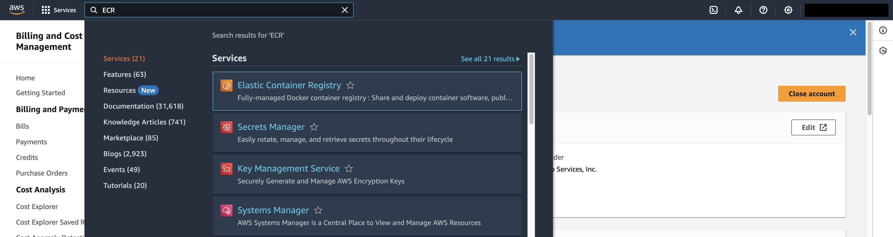
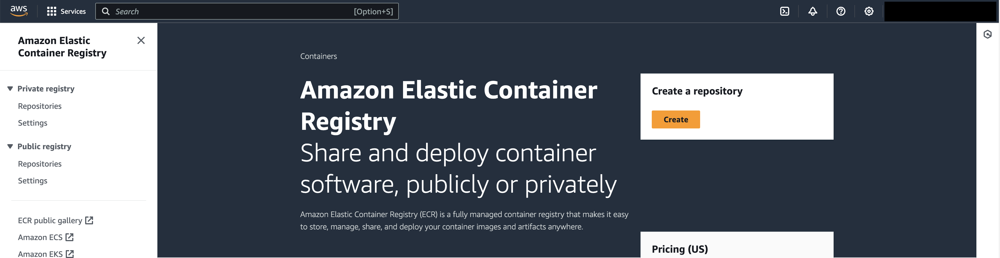
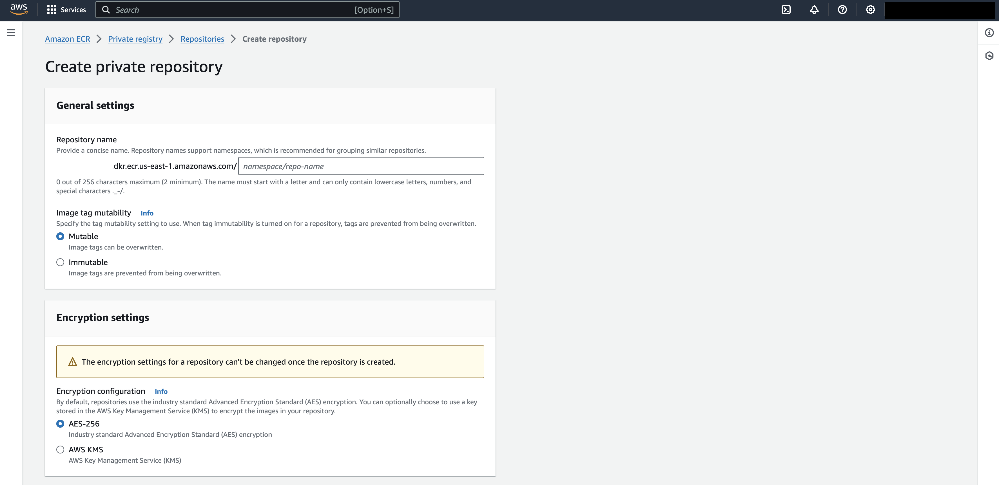
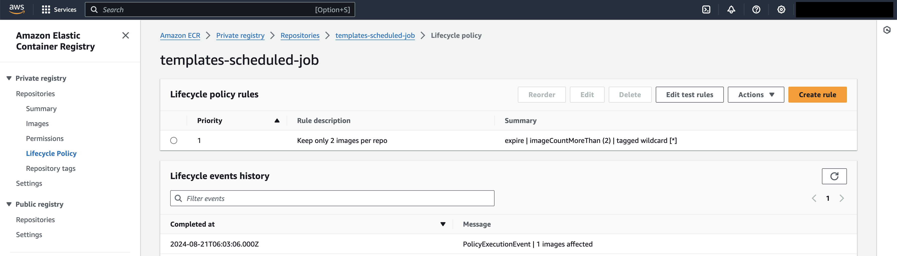
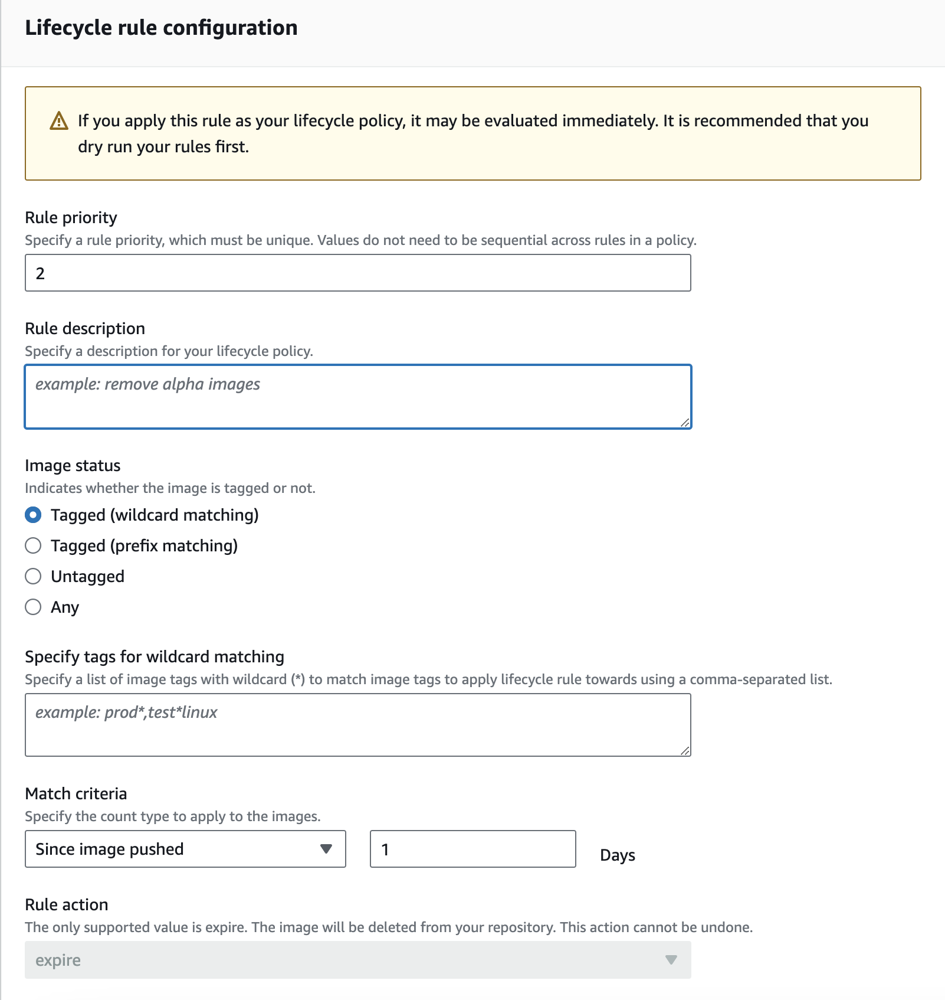
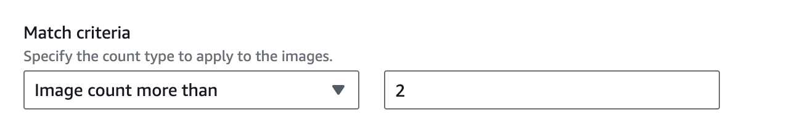

# Setting up image repository in AWS

The service that allows to store and manage docker images is called Elastic Container 
Registry. It can be found if typing ECR in a search bar. 

__Elastic Container Registry__ link redirects to the ECR service where one can create
a new repository or check the existing ones.

To create a repository, click on __Create__ button and follow the instruction:
+ In this case, the repository must be _mutable_ to be able to overwrite image tags
+ It is recommended to use repository name close (or the same) to the name of git repo
+ _namespace_ can be provided to group repositories together

Once a repository is created, it is possible to add rules that allow to remove old images.
That allows keeping repo size within reasonable limits. To create such a rule, click on
repository and go to __Lifecycle Policy__ link that appears on the left. There is also an
option to test rules before applying. That can be useful to make sure that rule does not
remove any important images. Below, you can see a rule that keeps only two most recent images
in the repository.

When creating a new rule, you must indicate a few parameters:

+ __Rule priority__: this indicates a sequential order of rules execution if multiple defined
+ __Rule description__: short string to help to understand what rule does
+ __Image status__: indicates which images must be targeted by a rule
+ __Tags for wildcard matching__: allows filtering images to be targeted by a rule
+ __Match criteria__: indicates what images need to be removed. It can be by time or by count.
  